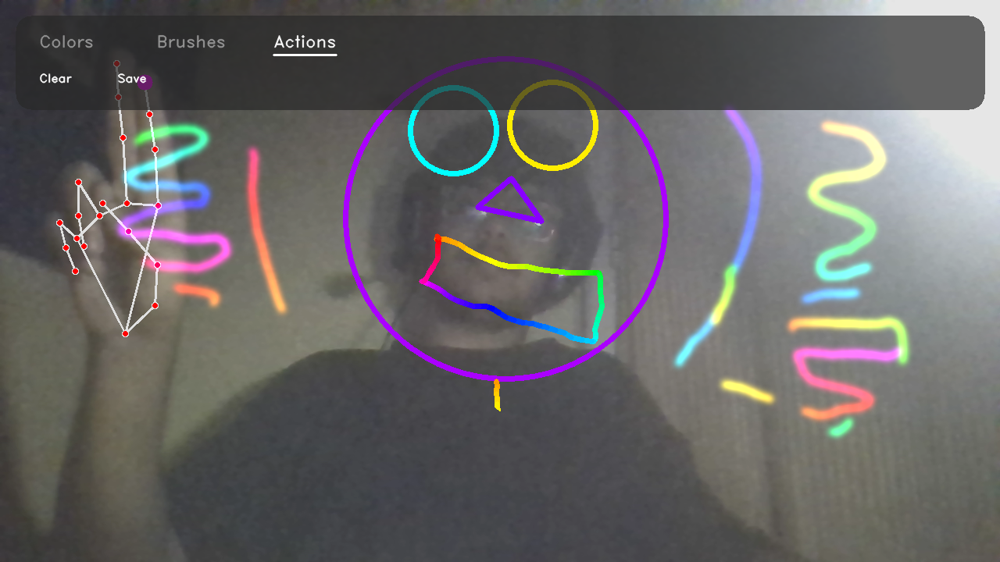

# 🎨 AI Virtual Canvas - Premium Edition



A high-performance, professional-grade interactive drawing application powered by **OpenCV** and **MediaPipe**. This project transforms your webcam into a digital canvas, allowing you to create art in mid-air with advanced features like neon glow, intelligent shape snapping, and intuitive palm gestures.

---

## 🌟 Key Features

### 🚀 Advanced Rendering
*   **Neon Glow Brush:** Real-time Gaussian-blurred glow layers for a futuristic light-painting effect.
*   **Rainbow Spectrum:** A dynamic brush that cycles through the HSV color spectrum as you move.
*   **Glassmorphism UI:** A modern, semi-transparent HUD with smooth category transitions (Colors, Brushes, Actions).
*   **EMA Smoothing:** Exponential Moving Average tracking to ensure silky-smooth lines even with jittery hand movements.

### 🧠 Intelligent Interaction
*   **Shape Snapping:** Draw a rough circle, square, or triangle; the AI analyzes the geometric heuristics and "snaps" it into a perfect primitive.
*   **Palm-to-Erase:** An intuitive gesture-based eraser that activates when you show an open palm (all fingers up).
*   **Finger Selection:** Use two fingers (Index + Middle) to navigate the premium menu and change tools mid-air.

---

## ✋ Gesture Guide

| Gesture | Action | Description |
| :--- | :--- | :--- |
| **Index Up** | 🖌️ **Draw** | Standard drawing mode using the active brush. |
| **Index + Middle Up** | 👆 **Select** | Hover over the top bar to change colors or modes. |
| **Open Palm** | 🧽 **Erase** | High-powered eraser centered on your palm. |
| **Closed Shape** | 📐 **Snap** | Close a shape (start = end) to trigger geometric snapping. |

---

## 🛠️ Installation & Setup

### Prerequisites
*   Python 3.10+
*   Webcam

### 1. Clone the Repository
```bash
git clone https://github.com/SparshMishra09/Hand_Gesture_Control.git
cd Hand_Gesture_Control
```

### 2. Install Dependencies
```bash
pip install -r requirements.txt
```

### 3. Launch the Application
```bash
python virtual_canvas.py
```

---

## 🏗️ Architectural Breakdown

The project uses a **Triple-Layer Stack** for high performance:
1.  **Webcam Layer:** Direct hardware feed processed with OpenCV.
2.  **Transient Stroke Layer:** A temporary "scratchpad" where active drawings live before being processed.
3.  **Permanent Canvas:** The final destination for "baked" doodles and snapped geometric shapes.

This separation allows the system to delete messy raw strokes instantly when a shape is "snapped," ensuring a professional, clean result every time.

---

## 📝 License
This project is open-source. Feel free to fork and enhance!

---

*Developed with ❤️ by Sparsh Mishra*
